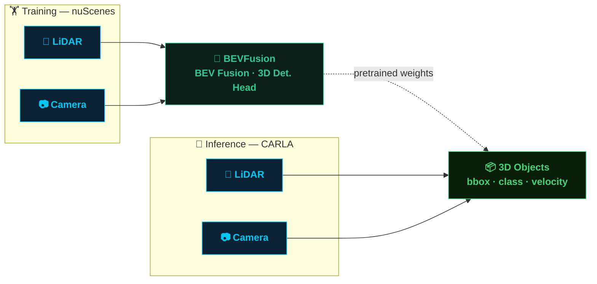
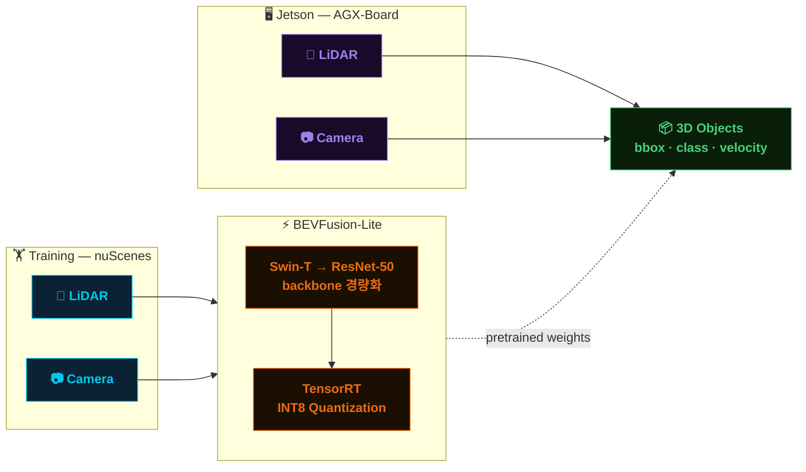
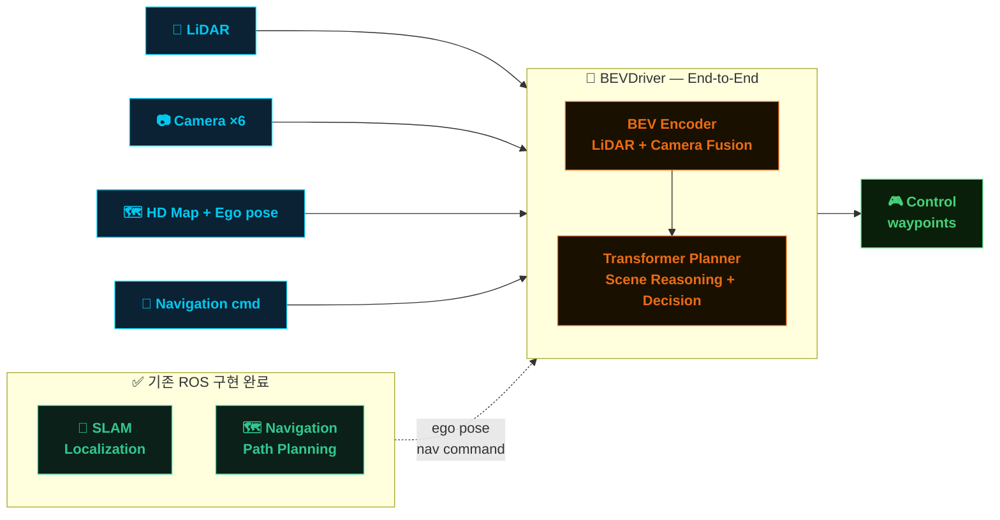

# BEVFusion on CARLA

> **BEVFusion**을 nuScenes로 학습하고, CARLA 시뮬레이터에서 3D 객체 인지를 검증합니다.



---

## 📌 프로젝트 소개

본 프로젝트는 멀티모달 3D 객체 인지 모델인 **BEVFusion**을 활용하여, 자율주행 시뮬레이터 **CARLA** 환경에서의 인지 성능을 검증하는 것을 목적으로 합니다.

BEVFusion은 LiDAR와 Camera 두 센서를 **Bird's Eye View(BEV) 공간에서 융합**함으로써, 단일 센서 대비 강인한 3D 객체 탐지 성능을 달성합니다. 실제 도로 데이터셋(nuScenes)으로 학습된 모델을 시뮬레이션 환경(CARLA)에 적용함으로써 **sim-to-real 전이 가능성**을 탐색합니다.

| 항목 | 내용 |
|------|------|
| 모델 | BEVFusion (MIT) |
| 학습 데이터 | nuScenes |
| 추론 환경 | CARLA Simulator v0.9.x |
| 입력 센서 | LiDAR (32-beam) + Camera (6×RGB) |
| 출력 | 3D Bounding Box · Class · Velocity |

---

## 🏋️ Training

nuScenes 데이터셋을 기반으로 BEVFusion 모델을 학습합니다.

```bash
# 학습 실행
python tools/train.py configs/bevfusion/bevfusion-3d-camera-lidar.py
```

| 설정 | 값 |
|------|----|
| Dataset | nuScenes v1.0 full data |
| Epochs | 20 |
| Batch Size | 2 |
| Optimizer | AdamW |
| LR Scheduler | CosineAnnealing |
| GPU | RTX 5090 |

---

## 🚗 Inference on CARLA

학습된 가중치를 바탕으로 CARLA 시뮬레이터에서 실시간 추론을 수행합니다.

```bash
# CARLA 서버 실행
./CarlaUE4.sh -world-port=2000

# 추론 실행
python tools/carla_inference.py \
    --config configs/bevfusion/bevfusion-3d-camera-lidar.py \
    --checkpoint checkpoints/bevfusion_nuscenes.pth \
    --carla-host localhost \
    --carla-port 2000
```

CARLA에서 수집한 LiDAR 포인트클라우드와 멀티뷰 카메라 이미지를 nuScenes 포맷으로 변환한 뒤 모델에 입력합니다.

---

## 📊 Results

### BEVFusion on CARLA


> **camera+lidar bev fusion object detection perception**

### CARLA Inference


> **carla object detection inference**

### Detection Performance

| Metric | nuScenes (val) | CARLA |
|--------|---------------|-------|
| mAP | 68.5 | - |
| NDS | 71.4 | - |
| Car AP | 84.3 | - |
| Pedestrian AP | 82.1 | - |
| Cyclist AP | 58.2 | - |

> CARLA 성능 수치는 추론 실험 완료 후 업데이트 예정입니다.

---

## ⚡ Lightweight BEVFusion on Jetson (On-Board)

> 카메라 백본을 **Swin-T → ResNet-50** 으로 교체하여 모델을 경량화하고, **NVIDIA Jetson** AGX 보드 환경에서 실시간 추론을 검증합니다.



| 항목 | 기존 BEVFusion | BEVFusion-Lite |
|------|--------------|----------------|
| Camera Backbone | Swin-T | ResNet-50 |
| 파라미터 수 | ~70M | ~35M |
| 추론 환경 | RTX 5090 | Jetson AGX |
| 최적화 | - | TensorRT INT8 |
| 목표 FPS | - | ≥ 20 FPS |

---

## 🤖 End-to-End Autonomous Driving with BEVDriver

> ROS 기반으로 **SLAM Localization**과 **Navigation**은 이미 완성된 상태입니다. 인지(Perception) 모듈에 더해, 이를 **단일 End-to-End 모델로 통합**하여 센서 입력에서 제어 명령까지 한 번에 처리하는 파이프라인을 구축합니다.

### 왜 E2E인가?

기존 자율주행 스택은 Perception → Prediction → Planning → Control의 **모듈형 파이프라인**으로 구성됩니다. 각 모듈 간 인터페이스와 오차 누적이 발생하며, 튜닝 포인트가 분산되어 있습니다. BEVDriver는 이 과정을 **하나의 Transformer 기반 모델로 압축**하여, 멀티센서 입력을 받아 직접 waypoint 또는 제어 신호를 출력합니다.



### BEVDriver 개요

| 항목 | 내용 |
|------|------|
| 모델 | [BEVDriver](https://github.com/OpenDriveLab/BEVDriver) |
| 기반 | BEV 특징 공간 + Transformer 계획기 |
| 입력 | LiDAR · Camera × 6 · HD Map · Ego pose · Navigation command |
| 출력 | 미래 waypoint 시퀀스 (→ 저수준 제어기 전달) |
| 학습 데이터 | nuScenes (BEVFusion pretrained weight 활용) |
| 기존 ROS와의 관계 | SLAM의 ego pose, Navigation의 방향 명령을 조건 입력으로 사용 |

### 통합 전략

기존 ROS 스택과의 **완전한 교체가 아닌 점진적 통합**을 목표로 합니다.

1. **BEVFusion pretrained weight를 BEVDriver 인코더 초기화에 활용** — nuScenes로 학습된 BEV 인코더 가중치를 그대로 재사용합니다.
2. **SLAM → Ego pose 공급** — BEVDriver는 현재 차량 위치를 외부에서 조건으로 입력받으므로, 기존 SLAM 모듈을 그대로 유지합니다.
3. **Navigation → 방향 명령 공급** — 고수준 경로 계획(목적지, 차선 변경 여부 등)은 기존 Navigation 스택이 담당하고, BEVDriver에 navigation command 형태로 전달합니다.
4. **BEVDriver → 제어 출력** — 최종적으로 waypoint를 생성하고 저수준 컨트롤러에 전달합니다.

```bash
# BEVDriver 추론 실행 (CARLA 환경)
python tools/bevdriver_inference.py \
    --config configs/bevdriver/bevdriver-carla.py \
    --bev-checkpoint checkpoints/bevfusion_nuscenes.pth \
    --e2e-checkpoint checkpoints/bevdriver_e2e.pth \
    --carla-host localhost \
    --carla-port 2000 \
    --ego-pose-topic /slam/pose \
    --nav-cmd-topic /navigation/command
```

### 기대 효과

| 항목 | 모듈형 파이프라인 | BEVDriver E2E |
|------|-----------------|---------------|
| 인터페이스 수 | Perception → Prediction → Planning → Control | 센서 입력 → 제어 출력 (단일) |
| 오차 누적 | 단계별 누적 | 최소화 |
| 실시간 지연 | 모듈 합산 | 단일 포워드 패스 |
| 튜닝 복잡도 | 모듈별 개별 튜닝 | 엔드-투-엔드 학습 |
| CARLA 검증 | BEVFusion 인지 성능 | 인지 + 계획 통합 성능 |
