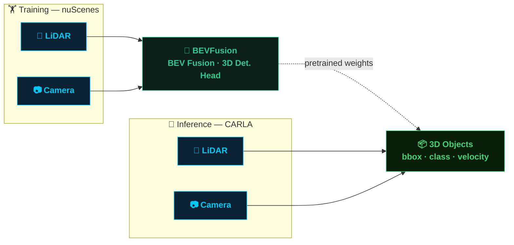
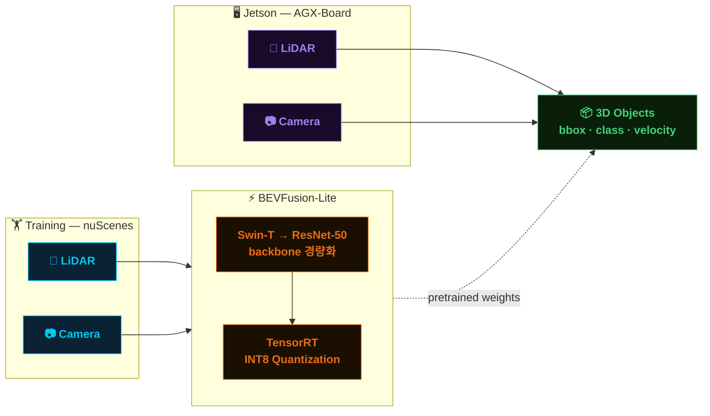

# BEVFusion on CARLA

> **BEVFusion**을 nuScenes로 학습하고, CARLA 시뮬레이터에서 3D 객체 인지를 검증합니다.



---

## 📌 프로젝트 소개

본 프로젝트는 멀티모달 3D 객체 인지 모델인 **BEVFusion**을 활용하여, 자율주행 시뮬레이터 **CARLA** 환경에서의 인지 성능을 검증하는 것을 목적으로 합니다.

BEVFusion은 LiDAR와 Camera 두 센서를 **Bird's Eye View(BEV) 공간에서 융합**함으로써, 단일 센서 대비 강인한 3D 객체 탐지 성능을 달성합니다. 실제 도로 데이터셋(nuScenes)으로 학습된 모델을 시뮬레이션 환경(CARLA)에 적용함으로써 **sim-to-real 전이 가능성**을 탐색합니다.

| 항목 | 내용 |
|------|------|
| 모델 | BEVFusion (MIT) |
| 학습 데이터 | nuScenes |
| 추론 환경 | CARLA Simulator v0.9.x |
| 입력 센서 | LiDAR (32-beam) + Camera (6×RGB) |
| 출력 | 3D Bounding Box · Class · Velocity |

---

## 🏋️ Training

nuScenes 데이터셋을 기반으로 BEVFusion 모델을 학습합니다.

```bash
# 학습 실행
python tools/train.py configs/bevfusion/bevfusion-3d-camera-lidar.py
```

| 설정 | 값 |
|------|----|
| Dataset | nuScenes v1.0 full data |
| Epochs | 20 |
| Batch Size | 2 |
| Optimizer | AdamW |
| LR Scheduler | CosineAnnealing |
| GPU | RTX 5090 |

---

## 🚗 Inference on CARLA

학습된 가중치를 바탕으로 CARLA 시뮬레이터에서 실시간 추론을 수행합니다.

```bash
# CARLA 서버 실행
./CarlaUE4.sh -world-port=2000

# 추론 실행
python tools/carla_inference.py \
    --config configs/bevfusion/bevfusion-3d-camera-lidar.py \
    --checkpoint checkpoints/bevfusion_nuscenes.pth \
    --carla-host localhost \
    --carla-port 2000
```

CARLA에서 수집한 LiDAR 포인트클라우드와 멀티뷰 카메라 이미지를 nuScenes 포맷으로 변환한 뒤 모델에 입력합니다.

---

## 📊 Results

### BEVFusion on CARLA


> **camera+lidar bev fusion object detection perception**

### CARLA Inference


> **carla object detection inference**

### Detection Performance

| Metric | nuScenes (val) | CARLA |
|--------|---------------|-------|
| mAP | 68.5 | - |
| NDS | 71.4 | - |
| Car AP | 84.3 | - |
| Pedestrian AP | 82.1 | - |
| Cyclist AP | 58.2 | - |

> CARLA 성능 수치는 추론 실험 완료 후 업데이트 예정입니다.

---

## ⚡ Lightweight BEVFusion on Jetson (On-Board)

> 카메라 백본을 **Swin-T → ResNet-50** 으로 교체하여 모델을 경량화하고, **NVIDIA Jetson** AGX 보드 환경에서 실시간 추론을 검증합니다.



| 항목 | 기존 BEVFusion | BEVFusion-Lite |
|------|--------------|----------------|
| Camera Backbone | Swin-T | ResNet-50 |
| 파라미터 수 | ~70M | ~35M |
| 추론 환경 | RTX 5090 | Jetson Orin |
| 최적화 | - | TensorRT INT8 |
| 목표 FPS | - | ≥ 20 FPS |

