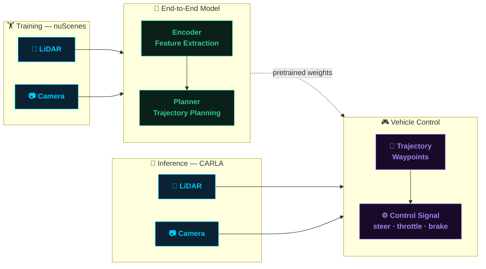

# end-to-end on CARLA

> ROS를 사용하지 않고 **end-to-end**모델로 CARLA 시뮬레이터에서 자율주행하는 프로그램(인지~제어까지)

```mermaid
flowchart LR
    subgraph TRAIN["🏋️ Training  —  nuScenes"]
        direction TB
        T_L["📡 LiDAR"]
        T_C["📷 Camera"]
    end

    subgraph MODEL["🧠 End-to-End Model"]
        direction TB
        ENC["Encoder<br/>Feature Extraction"]
        PLAN["Planner<br/>Trajectory Planning"]
        ENC --> PLAN
    end

    subgraph INFER["🚗 Inference  —  CARLA"]
        direction TB
        CA_L["📡 LiDAR"]
        CA_C["📷 Camera"]
    end

    subgraph CTRL["🎮 Vehicle Control"]
        direction TB
        TRAJ["📍 Trajectory<br/>Waypoints"]
        ACT["⚙️ Control Signal<br/>steer · throttle · brake"]
        TRAJ --> ACT
    end

    T_L & T_C --> MODEL
    MODEL -. "pretrained weights" .-> CTRL
    CA_L & CA_C --> CTRL

    classDef data    fill:#0a2233,stroke:#00d4ff,color:#00d4ffee,font-weight:bold
    classDef model   fill:#0a2018,stroke:#34d399,color:#34d399ee,font-weight:bold
    classDef control fill:#1a0a2a,stroke:#a78bfa,color:#a78bfaee,font-weight:bold

    class T_L,T_C,CA_L,CA_C data
    class ENC,PLAN model
    class TRAJ,ACT control
```

