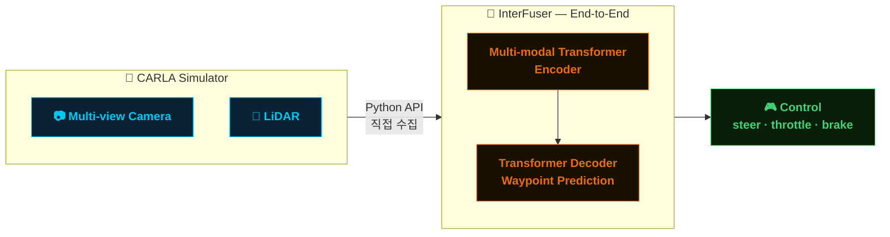

# InterFuser on CARLA

> **InterFuser** pretrained 모델을 활용하여, CARLA 시뮬레이터에서 ROS 없이 Python 기반 End-to-End 자율주행을 검증합니다.



---

## 📌 프로젝트 소개

본 프로젝트는 Transformer 기반 End-to-End 자율주행 모델인 **InterFuser**를 **CARLA 시뮬레이터**에서 검증하는 것을 목적으로 합니다.

ROS 미들웨어 없이 **CARLA Python API**로 센서 데이터를 직접 수집하고, InterFuser에 입력하여 조향·가속·제동 제어 명령을 출력하는 경량 파이프라인을 구성합니다.

| 항목 | 내용 |
|------|------|
| 모델 | [InterFuser](https://github.com/opendilab/InterFuser) |
| 아키텍처 | Multi-modal Transformer (Camera + LiDAR) |
| 추론 환경 | CARLA Simulator v0.9.x |
| 입력 센서 | Multi-view Camera + LiDAR |
| 출력 | steer · throttle · brake |
| 미들웨어 | ROS 미사용 — CARLA Python API 직접 연동 |

---

## 🗂️ 진행 현황

| 단계 | 항목 | 상태 |
|------|------|------|
| 1 | Transformer 기초 학습 (ViT · DETR · SETR · Swin) | ✅ 완료 |
| 2 | CARLA 환경 준비 | 🔄 진행 중 |
| 3 | InterFuser pretrained 모델 CARLA 추론 | ⏳ 예정 |
| 4 | 성능 평가 (CARLA Leaderboard 지표) | ⏳ 예정 |

---

## 📚 Transformer 기초 학습

InterFuser의 핵심이 Transformer 아키텍처인 만큼, 아래 모델들을 선행 학습하였습니다.

| 모델 | 핵심 개념 | 학습 목적 |
|------|----------|----------|
| **ViT** | Image Patch → Token, Self-Attention | 이미지를 Transformer로 처리하는 기본 원리 이해 |
| **DETR** | Object Query, Bipartite Matching | Transformer 기반 객체 탐지 구조 이해 |
| **SETR** | Encoder-only Segmentation | Dense prediction에서의 Transformer 활용 |
| **Swin** | Shifted Window Attention, Hierarchical | 효율적인 Vision Transformer 구조 이해 |

---

## 🚗 Inference on CARLA

GitHub에서 제공하는 사전학습 가중치를 받아, CARLA 시뮬레이터에서 추론을 실행합니다.

ROS 없이 CARLA Python API로 센서 데이터를 직접 수집하여 InterFuser에 입력합니다.

```bash
# CARLA 서버 실행
./CarlaUE4.sh -world-port=2000

# InterFuser pretrained 모델 추론
python leaderboard/team_code/interfuser_agent.py \
    --checkpoint pretrained/interfuser.pth.tar \
    --carla-host localhost \
    --carla-port 2000
```

### 파이프라인 구조

```
CARLA Simulator
    ├── 📷 Multi-view Camera  ─┐
    └── 📡 LiDAR              ─┤
                               ▼
                     CARLA Python API
                     (직접 센서 수집)
                               ▼
                 InterFuser Transformer
                 ├── Multi-modal Encoder
                 └── Waypoint Decoder
                               ▼
                    🎮 steer / throttle / brake
```

---

## 📊 Results

> CARLA 추론 실험 완료 후 업데이트 예정입니다.

| Metric | 값 |
|--------|----|
| Driving Score | - |
| Route Completion | - |
| Infraction Penalty | - |

---

## 🔜 향후 계획

1. **CARLA 환경 준비 완료** — 시뮬레이터 세팅 및 센서 구성
2. **Pretrained 모델 추론** — 제공 가중치로 CARLA 추론 실행
3. **성능 평가** — CARLA Leaderboard 기준 지표 측정
